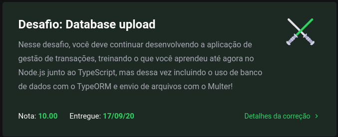

<h1 align="center">
  Desafio 06: Banco de dados e upload de arquivos no Node.js
</h1>

<blockquote align="center">“Só deseje as coisas as quais você está disposto a lutar”!</blockquote>

## Sobre o desafio 💪
Mais um desafio do GoStack 13.0! 🚀  
Um desafio bem complicado, levei dias para finalizar, teve relacionamentos no banco de dados, inserção de dados via arquivo .csv, e diversas outras funcionalidades do TypeORM. 
Esse módulo foi o mais desafiador, porém foi incrível, aprendi typeorm,migrations,autenticação com JWT, como lidar com upload de arquivos e uma boa forma de lidar com exceções. 📈  
Foi usado o Jest (uma estrutura de testes criada pelo Facebook) para realizar os testes e ver se passamos no desafio, os testes eram os seguintes 🛠  
</img>  
Para mais detalhes sobre o desafio e que era precisa ser feito para ser passado em cada teste, você pode ver neste <a href="https://github.com/rocketseat-education/bootcamp-gostack-desafios/tree/master/desafio-database-upload">link</a>.

## 7/7 Testes Concluídos 🎯
Consegui passar no teste, e isso me garantiu uma nota 10.00 nesse desafio. 😀
</img>
